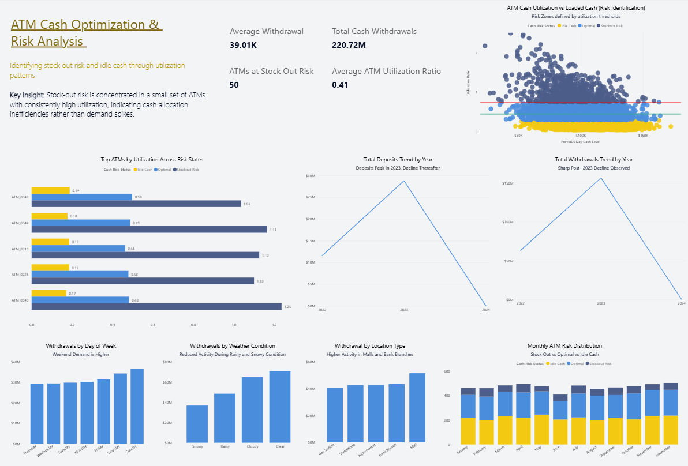

# 🏦 ATM Cash Optimization & Risk Analysis

## 📌 Project Overview
This project analyzes ATM cash usage patterns to identify **stock-out risk** and **idle cash inefficiencies**.  
Using **Python, MySQL, and Power BI**, it builds an end-to-end analytics pipeline and an executive-ready dashboard to support **cash replenishment and optimization decisions**.

---

## 🎯 Business Problem
Banks must balance two competing risks:
- **Stock-outs** → lost transactions and poor customer experience
- **Idle cash** → higher holding costs and operational inefficiency

This project answers:
- Which ATMs are at **stock-out risk**?
- Where is cash being **over-allocated**?
- How do **time, weather, location, and trends** affect ATM usage?

---

## 🧱 Tech Stack
- **Python** – Data ingestion
- **MySQL** – Data cleaning & transformation
- **Power BI** – Data modeling & visualization

---

## 📂 Data Source
**ATM Cash Demand Forecasting & Management Dataset**

Includes:
- ATM ID
- Date & time
- Location type
- Weather condition
- Day of week
- Withdrawals & deposits
- Cash levels
- Forecasted next-day demand

---

## 🔄 End-to-End Data Pipeline

### 1️⃣ Data Loading (Python → MySQL)
A Python script loads the CSV into MySQL.

## 📐 Data Assumptions

To reflect realistic banking behavior, the analysis assumes:
- Higher ATM usage on weekends
- Reduced activity during rainy and snowy weather
- Peak transactions during daytime and afternoon hours
- Higher demand in malls and bank branches
- Peak cash activity in 2023 followed by a decline

These assumptions were applied consistently across the dataset and are documented for transparency.

## 📊 Dashboard & Visual Analysis

### 🔢 KPI Summary (Top Row)

**Purpose:**  
Provide an instant operational snapshot of ATM cash performance.

**Metrics:**
- **Total Cash Withdrawals** – Overall cash demand
- **Average Withdrawal per ATM** – Average transaction scale
- **Average ATM Utilization Ratio** – Efficiency of cash usage
- **ATMs at Stock-Out Risk** – Number of critical ATMs requiring immediate attention

**Insight:**  
A small subset of ATMs contributes disproportionately to operational risk.

---

### 🔹 Scatter Plot — *ATM Cash Utilization vs Loaded Cash (Risk Identification)*

**What it shows:**
- Relationship between cash loaded and utilization
- Risk segmentation using utilization thresholds

**Insight:**
- High utilization at low cash levels → **Stock-out risk**
- Low utilization at high cash levels → **Idle cash**
- Clear inverse relationship validates utilization as a reliable risk metric

**Why it matters:**  
This visual directly identifies **inefficient cash allocation**, not just high demand.

---

### 🔹 Bar Chart — *Top ATMs by Utilization Across Risk States*

**What it shows:**
- Utilization behavior of the highest-risk ATMs across different risk categories

**Insight:**
- The same ATMs repeatedly exceed optimal utilization levels
- Indicates **systemic under-funding**, not one-time demand spikes

**Why it matters:**  
Helps prioritize **which ATMs to replenish first**.

---

### 🔹 Line Charts — *Deposits & Withdrawals Trend by Year*

**What they show:**
- Long-term trends in cash movement

**Insight:**
- Transaction volumes peak in **2023**
- Noticeable decline post-2023
- Suggests changing customer behavior or reduced cash dependency

**Why it matters:**  
Supports **strategic planning** and long-term cash forecasting.

---

### 🔹 Bar Chart — *Withdrawals by Day of Week*

**What it shows:**
- Weekly demand patterns

**Insight:**
- Higher withdrawals on weekends
- Consistent behavior during weekdays

**Why it matters:**  
Enables **day-based cash loading strategies**.

---

### 🔹 Bar Chart — *Withdrawals by Weather Condition*

**What it shows:**
- Impact of weather on ATM usage

**Insight:**
- Reduced activity during rainy and snowy conditions
- Clear weather-driven behavioral changes

**Why it matters:**  
Enables **weather-aware replenishment planning**.

---

### 🔹 Bar Chart — *Withdrawals by Location Type*

**What it shows:**
- ATM demand by physical context

**Insight:**
- Highest activity in malls and bank branches
- Lower demand in residential and gas station locations

**Why it matters:**  
Supports **location-specific cash allocation**.

---

### 🔹 Stacked Bar Chart — *Monthly ATM Risk Distribution*

**What it shows:**
- Monthly distribution of stock-out, optimal, and idle-cash ATMs

**Insight:**
- Stock-out risk persists throughout the year
- Idle cash remains an ongoing optimization opportunity

**Why it matters:**  
Highlights **structural inefficiencies**, not seasonal noise.

---

## 🧠 Key Insights Summary
- Stock-out risk is concentrated in a **small subset of ATMs**
- High utilization often reflects **under-funding**, not excess demand
- Significant idle cash exists in over-loaded ATMs
- Behavioral factors (time, weather, location) strongly influence ATM usage
- Cash allocation inefficiencies are **actionable and correctable**

---

## ✅ Action Statement
> Reallocate cash by prioritizing replenishment for high-utilization ATMs while reducing excess cash at idle locations, using behavioral and temporal demand patterns to improve service reliability and reduce holding costs.

---

## 📈 What This Project Demonstrates
- End-to-end data pipeline design
- Financial data modeling best practices
- SQL-driven transformations
- Executive-ready dashboard storytelling
- Optimization-focused analytics thinking

## ⚠️ Limitations
- Dataset is simulated and may not capture all real-world anomalies
- Forecasting is directional, not predictive modeling
- External factors such as regional events are not included

